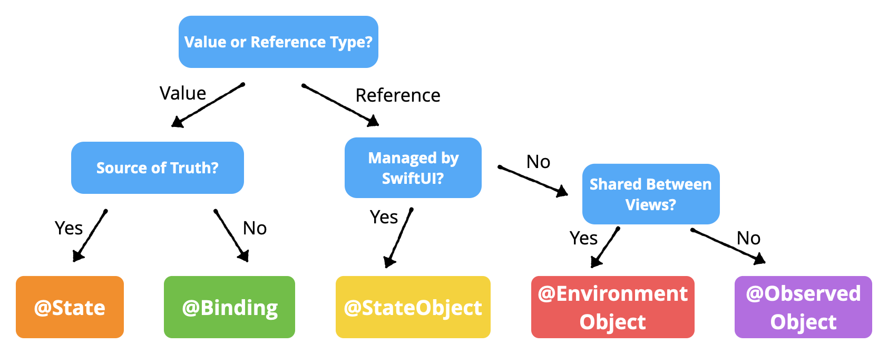

#  Understanding Data Flow in SwiftUI

A [RW tutorial](https://www.raywenderlich.com/11781349-understanding-data-flow-in-swiftui)

See also [State and Data Flow](https://developer.apple.com/documentation/swiftui/state-and-data-flow)

## Property Wrappers in SwiftUI

```
@State
@Binding
@StateObject
@ObservedObject
@EnvironmentObject
@Environment
```


| `wrapper / protocol` | `type`      | `note / example`    |
|----------------------|-------------|---------------------|
| `@State`             | `value`     | `local state within a view` |
| `@Binding`           | `reference` | `share a reference to a source of truth` |
| `@StateObject`       | `reference` |  `@StateObject var movieStore = MovieStore()`|
| `ObservableObject`   | `protocol`  | `object with a publisher that emits before`<br/>` the object has changed`<br/> |
| `@ObservedObject`    | `reference` | `class MovieStore: ObservableObject`<br/> |
| `@EnvironmentObject` | `reference` | `class UserStore: ObservableObject,`<br/>`with at least one @Published variable;`<br/>`@EnvironmentObject var userStore: UserStore`<br/>`supplied to an ancestor object,`<br/>` visible by descenants` |
| `@Environment`       |             |  |
|                      |             |  |
| `@ Published `       |             | `triggers updates in observers `<br/>`of an ObservableObject` |

|    `example`         | `comment`    |  `note`|
|----------------------|---------------------|---------------------|
| `@State private var isVisible = true`  |  `declare isVisible as a state variable` | |
| `if isVisible { Text("Hello") }` | `render only when isVisible is true` | `wrapped value`|
| `Toggle("Visible", isOn: $isVisible)` | `update the wrapped value`     |`projected value`|
|                      |             |
|                      |             |
|                      |             |

### Which wrapper?


